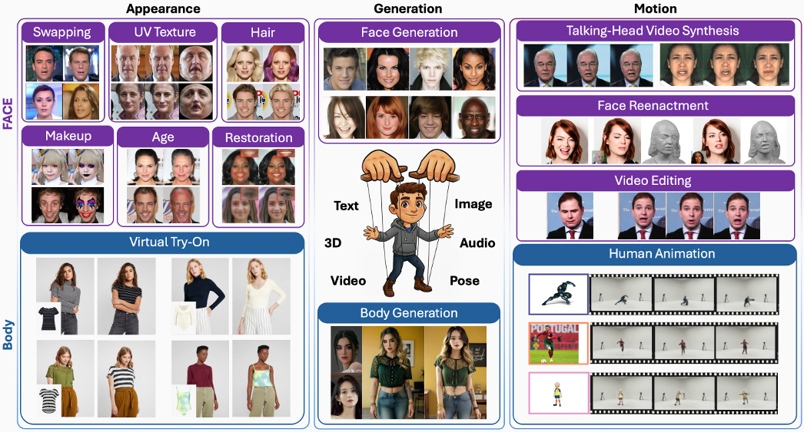

# Awesome-Diffusion-Human-Centric  

---

  

## 📑 Table
- [🧑🏻 Face](#-face)
  - [Face Generation](#face-generation)
  - [Face Editing](#face-editing)
  - [Face Animation](#face-animation)
- [🏃 Body](#-body)
  - [Body Generation](#body-generation)
  - [Virtual Try-On](#virtual-try-on)
  - [Human Animation](#human-animation)

--- 

## 🧑🏻 Face

### Face Generation
* **DiffusionCLIP: Text-Guided Diffusion Models for Robust Image Manipulation** | *CVPR '22* | [[Paper]](https://arxiv.org/abs/2110.02711)
* **Diffusion Models Already Have a Semantic Latent Space** | *ICLR '22* | [[Paper]](https://arxiv.org/abs/2210.10960)
* **Collaborative Diffusion for Multi-Modal Face Generation and Editing** | *CVPR '23* | [[Paper]](https://arxiv.org/abs/2304.10530)
* **DiffusionRig: Learning Personalized Priors for Facial Appearance Editing** | *CVPR '23* | [[Paper]](https://arxiv.org/abs/2304.06711)
* **Diffusion Autoencoders: Toward a Meaningful and Decodable Representation** | *CVPR '22* | [[Paper]](https://openaccess.thecvf.com/content/CVPR2022/html/Preechakul_Diffusion_Autoencoders_Toward_a_Meaningful_and_Decodable_Representation_CVPR_2022_paper.html)
* **FaceComposer: A Unified Model for Versatile Facial Content Creation** | *NeurIPS '23* | [[Paper]](https://proceedings.neurips.cc/paper_files/paper/2023/hash/2b4caf39e645680f826ae0a9e7ae9402-Abstract-Conference.html)
* **Diffusion-Driven GAN Inversion for Multi-Modal Face Image Generation** | *CVPR '24* | [[Paper]](https://arxiv.org/abs/2405.04356)
* **DreamSalon: A Staged Diffusion Framework for Preserving Identity-Context in Editable Face Generation** | *CVPR '24* | [[Paper]](https://arxiv.org/abs/2403.19235)
* **DiffTV: Identity-Preserved Thermal-to-Visible Face Translation via Feature Alignment and Dual-Stage Conditions** | *ACM MM '24* | [[Paper]](https://dl.acm.org/doi/10.1145/3664647.3680635)
* **Uncovering the Disentanglement Capability in Text-to-Image Diffusion Models** | *CVPR '23* | [[Paper]](https://arxiv.org/abs/2212.08698)
* **Towards a Simultaneous and Granular Identity-Expression Control in Personalized Face Generation** | *CVPR '24* | [[Paper]](https://arxiv.org/abs/2401.01207)
* **Arc2Face: A Foundation Model for ID-Consistent Human Faces** | *ECCV '24* | [[Paper]](https://arxiv.org/abs/2403.11641)
* **Z-Magic: Zero-Shot Multiple Attributes Guided Image Creator** | *CVPR '25* | [[Paper]](https://arxiv.org/abs/2503.12124)

### Face Editing
* **DiffFace: Diffusion-based Face Swapping with Facial Guidance** | *PR '25* | [[Paper]](https://arxiv.org/abs/2212.13344)
* **DiffSwap: High-Fidelity and Controllable Face Swapping via 3D-Aware Masked Diffusion** | *CVPR '23* | [[Paper]](https://openaccess.thecvf.com/content/CVPR2023/papers/Zhao_DiffSwap_High-Fidelity_and_Controllable_Face_Swapping_via_3D-Aware_Masked_Diffusion_CVPR_2023_paper.pdf)
* **Face Adapter for Pre-Trained Diffusion Models with Fine-Grained ID and Attribute Control** | *ECCV '24* | [[Paper]](https://arxiv.org/abs/2405.12970)
* **FuseAnyPart: Diffusion-Driven Facial Parts Swapping via Multiple Reference Images** | *NeurIPS '24* | [[Paper]](https://arxiv.org/abs/2410.22771)
* **DynamicFace: High-Quality and Consistent Face Swapping for Image and Video Using Composable 3D Facial Priors** | *ICCV '25* | [[Paper]](https://arxiv.org/abs/2501.08553)
* **VividFace: A Diffusion-Based Hybrid Framework for High-Fidelity Video Face Swapping** | *arXiv '24* | [[Paper]](https://arxiv.org/abs/2412.11279)
* **CanonSwap: High-Fidelity and Consistent Video Face Swapping via Canonical Space Modulation** | *ICCV '25* | [[Paper]](https://arxiv.org/abs/2507.02691)
* **Toward Tiny and High-Quality Facial Makeup with Data Amplify Learning** | *ECCV '24* | [[Paper]](https://arxiv.org/abs/2403.15033)
* **StableMakeup: When Real-World Makeup Transfer Meets Diffusion Model** | *SIGGRAPH '25* | [[Paper]](https://arxiv.org/abs/2403.07764)
* **SHMT: Self-Supervised Hierarchical Makeup Transfer via Latent Diffusion Models** | *NeurIPS '24* | [[Paper]](https://arxiv.org/abs/2412.11058)
* **DiffAM: Diffusion-Based Adversarial Makeup Transfer for Facial Privacy Protection** | *CVPR '24* | [[Paper]](https://arxiv.org/abs/2405.09882)
* **MAD: Makeup All-in-One with Cross-Domain Diffusion Model** | *CVPR '25* | [[Paper]](https://arxiv.org/abs/2504.02545)
* **FLUX-Makeup: High-Fidelity, Identity-Consistent, and Robust Makeup Transfer via Diffusion Transformer** | *arXiv '25* | [[Paper]](https://arxiv.org/abs/2508.05069)
* **Stable-Hair v2: Real-World Hair Transfer via Multiple-View Diffusion Model** | *arXiv '25* | [[Paper]](https://arxiv.org/abs/2507.07591)
* **DiffLocks: Generating 3D Hair from a Single Image Using Diffusion Models** | *CVPR '25* | [[Paper]](https://arxiv.org/abs/2505.06166)
* **HairShifter: Consistent and High-Fidelity Video Hair Transfer via Anchor-Guided Animation** | *ACM MM '25* | [[Paper]](https://arxiv.org/abs/2507.12758)
* **HairDiffusion: Vivid Multi-Colored Hair Editing via Latent Diffusion** | *NeurIPS '24* | [[Paper]](https://arxiv.org/abs/2410.21789)
* **Stable-Hair: Real-World Hair Transfer via Diffusion Model** | *AAAI '25* | [[Paper]](https://arxiv.org/abs/2507.07591)
* **Face Aging via Diffusion-Based Editing** | *BMVC '23* | [[Paper]](https://arxiv.org/abs/2309.11321)
* **Identity-Preserving Aging of Face Images via Latent Diffusion Models** | *IJCB '23* | [[Paper]](https://arxiv.org/abs/2307.08585)
* **TimeBooth: Disentangled Facial Invariant Representation for Diverse and Personalized Face Aging** | *ICCV '25* | [[Paper]](https://openaccess.thecvf.com/content/ICCV2025/papers/Su_TimeBooth_Disentangled_Facial_Invariant_Representation_for_Diverse_and_Personalized_Face_ICCV_2025_paper.pdf)
* **UV-IDM: Identity-Conditioned Latent Diffusion Model for Face UV-Texture Generation** | *CVPR '24* | [[Paper]](https://openaccess.thecvf.com/content/CVPR2024/html/Li_UV-IDM_Identity-Conditioned_Latent_Diffusion_Model_for_Face_UV-Texture_Generation_CVPR_2024_paper.html)
* **FreeUV: Ground-Truth-Free Realistic Facial UV Texture Recovery via Cross-Assembly Inference Strategy** | *CVPR '25* | [[Paper]](https://arxiv.org/abs/2503.17197)
* **UVMap-ID: A Controllable and Personalized UV Map Generative Model** | *ACM MM '24* | [[Paper]](https://arxiv.org/abs/2404.14568)
* **PGDiff: Guiding Diffusion Models for Versatile Face Restoration via Partial Guidance** | *NeurIPS '23* | [[Paper]](https://arxiv.org/abs/2309.10810)
* **DR2: Diffusion-Based Robust Degradation Remover for Blind Face Restoration** | *CVPR '23* | [[Paper]](https://arxiv.org/abs/2303.06885)
* **DiffBFR: Bootstrapping Diffusion Model for Blind Face Restoration** | *ACM MM '23* | [[Paper]](https://arxiv.org/abs/2305.04517)
* **Towards Authentic Face Restoration with Iterative Diffusion Models and Beyond** | *ICCV '23* | [[Paper]](https://arxiv.org/abs/2307.08996)
* **Diffuse and Restore: A Region-Adaptive Diffusion Model for Identity-Preserving Blind Face Restoration** | *WACV '24* | [[Paper]](https://openaccess.thecvf.com/content/WACV2024/papers/Suin_Diffuse_and_Restore_A_Region-Adaptive_Diffusion_Model_for_Identity-Preserving_Blind_WACV_2024_paper.pdf)
* **DynFaceRestore: Balancing Fidelity and Quality in Diffusion-Guided Blind Face Restoration with Dynamic Blur-Level Mapping and Guidance** | *ICCV '25* | [[Paper]](https://arxiv.org/abs/2507.13797)
* **OSDFace: One-Step Diffusion Model for Face Restoration** | *CVPR '25* | [[Paper]](https://arxiv.org/abs/2411.17163)
* **Toward Real-World Blind Face Restoration with Generative Diffusion Prior** | *TCSVT '24* | [[Paper]](https://arxiv.org/abs/2312.15736)
* **Overcoming False Illusions in Real-World Face Restoration with Multi-Modal Guided Diffusion Model** | *ICLR '25* | [[Paper]](https://arxiv.org/abs/2410.04161)

### Face Animation
* **Dae-talker: High fidelity speech-driven talking face generation with diffusion autoencoder** | *ACM MM '23* | [[Paper]](https://arxiv.org/abs/2303.17550)
* **Fd2talk: Towards generalized talking head generation with facial decoupled diffusion model** | *ACM MM '24* | [[Paper]](https://arxiv.org/abs/2408.09384)
* **Gaia: Zero-shot talking avatar generation** | *ICLR '23* | [[Paper]](https://arxiv.org/abs/2311.15230)
* **Mfr-net: Multi-faceted responsive listening head generation via denoising diffusion model** | *ACM MM '23* | [[Paper]](https://arxiv.org/abs/2308.16635)
* **Landmark-guided diffusion model for high-fidelity and temporally coherent talking head generation** | *ICME '24* | [[Paper]](https://arxiv.org/abs/2408.01732)
* **Laughing matters: Introducing laughing-face generation using diffusion models** | *arXiv '23* | [[Paper]](https://arxiv.org/abs/2305.08854)
* **Multimodal fusion for talking face generation utilizing speech-related facial action units** | *TOMM '24* | [[Paper]](https://mftfg-au.github.io/Multimodal_Fusion/)
* **Vasa-1: Lifelike audio-driven talking faces generated in real time** | *NeurIPS '24* | [[Paper]](https://arxiv.org/abs/2404.10667)
* **Diffused heads: Diffusion models beat gans on talking-face generation** | *WACV '24* | [[Paper]](https://openaccess.thecvf.com/content/WACV2024/papers/Kligvasser_Diffused_Heads_Diffusion_Models_Beat_GANs_on_Talking-Face_Generation_WACV_2024_paper.pdf)
* **Talking head generation with probabilistic audio-to-visual diffusion priors** | *ICCV '23* | [[Paper]](https://arxiv.org/abs/2212.04248)
* **Audio-driven talking head video generation with diffusion model** | *ICASSP '23* | [[Paper]](https://ieeexplore.ieee.org/abstract/document/10094937)
* **Diff2lip: Audio conditioned diffusion models for lip-synchronization** | *WACV '24* | [[Paper]](https://arxiv.org/abs/2308.09716)
* **Diffdub: Person-generic visual dubbing using inpainting renderer with diffusion auto-encoder** | *ICASSP '24* | [[Paper]](https://arxiv.org/abs/2311.01811)
* **Difftalk: Crafting diffusion models for generalized audio-driven portraits animation** | *CVPR '23* | [[Paper]](https://arxiv.org/abs/2301.03786)
* **Float: Generative motion latent flow matching for audio-driven talking portrait** | *ICCV '25* | [[Paper]](https://arxiv.org/abs/2412.01064)
* **Emo: Emote portrait alive generating expressive portrait videos with audio2video diffusion model under weak conditions** | *ECCV '25* | [[Paper]](https://arxiv.org/abs/2402.17485)
* **Eat-face: Emotion-controllable audio-driven talking face generation via diffusion model** | *FG '24* | [[Paper]](https://www.semanticscholar.org/paper/EAT-Face%3A-Emotion-Controllable-Audio-Driven-Talking-Wang-Jia/7b142d08b1319ab1d759083ff65b153400c907cb)
* **Emotalker: Emotionally editable talking face generation via diffusion model** | *ICASSP '24* | [[Paper]](https://arxiv.org/abs/2401.08049)
* **Emotivetalk: Expressive talking head generation through audio information decoupling and emotional video diffusion** | *CVPR '25* | [[Paper]](https://arxiv.org/abs/2411.16726)
* **Facechain-imagineid: Freely crafting high-fidelity diverse talking faces from disentangled audio** | *CVPR '24* | [[Paper]](https://openaccess.thecvf.com/content/CVPR2024/papers/Xu_FaceChain-ImagineID_Freely_Crafting_High-Fidelity_Diverse_Talking_Faces_from_Disentangled_Audio_CVPR_2024_paper.pdf)
* **Hallo: Hierarchical audio-driven visual synthesis for portrait image animation** | *arXiv '24* | [[Paper]](https://arxiv.org/abs/2406.08801)
* **Loopy: Taming audio-driven portrait avatar with long-term motion dependency** | *arXiv '24* | [[Paper]](https://arxiv.org/abs/2409.02634)
* **Realistic speech-to-face generation with speech-conditioned latent diffusion model with face prior** | *arXiv '23* | [[Paper]](https://arxiv.org/abs/2310.03363)
* **Svp: Style-enhanced vivid portrait talking head diffusion model** | *arXiv '24* | [[Paper]](https://arxiv.org/abs/2409.03270)
* **Control-talker: A rapid-customization talking head generation method for multi-condition control and high-texture enhancement** | *ACM MM '24* | [[Paper]](https://dl.acm.org/doi/10.1145/3664647.3681644)
* **Keyface: Expressive audio-driven facial animation for long sequences via keyframe interpolation** | *CVPR '25* | [[Paper]](https://arxiv.org/abs/2503.01715)
* **Stableavatar: Infinite-length audio-driven avatar video generation** | *arXiv '25* | [[Paper]](https://arxiv.org/abs/2508.08248)
* **Sonic: Shifting focus to global audio perception in portrait animation** | *CVPR '25* | [[Paper]](https://arxiv.org/abs/2411.16331)
* **Leo: Generative latent image animator for human video synthesis** | *IJCV '24* | [[Paper]](https://arxiv.org/abs/2305.03989)
* **Diffusionact: Controllable diffusion autoencoder for one-shot face reenactment** | *FG '25* | [[Paper]](https://arxiv.org/abs/2403.17217)
* **Moditalker: Motion-disentangled diffusion model for high-fidelity talking head generation** | *AAAI '25* | [[Paper]](https://arxiv.org/abs/2403.19144)
* **Anchored diffusion for video face reenactment** | *WACV '25* | [[Paper]](https://openaccess.thecvf.com/content/WACV2025/papers/Kligvasser_Anchored_Diffusion_for_Video_Face_Reenactment_WACV_2025_paper.pdf)
* **Fantasyportrait: Enhancing multi-character portrait animation with expression-augmented diffusion transformers** | *arXiv '25* | [[Paper]](https://arxiv.org/abs/2507.12956)
* **X-portrait: Expressive portrait animation with hierarchical motion attention** | *SIGGRAPH '24* | [[Paper]](https://arxiv.org/abs/2403.15931)
* **Megactor: Harness the power of raw video for vivid portrait animation** | *arXiv '24* | [[Paper]](https://arxiv.org/abs/2405.20851)
* **Mimaface: Face animation via motion-identity modulated appearance feature learning** | *arXiv '24* | [[Paper]](https://arxiv.org/abs/2409.15179)
* **Fantasytalking: Enhancing multi-character portrait animation with expression-augmented diffusion transformers** | *arXiv '25* | [[Paper]](https://arxiv.org/abs/2504.04842)
* **Text-based talking video editing with cascaded conditional diffusion** | *arXiv '24* | [[Paper]](https://arxiv.org/abs/2407.14841)
* **Text-driven synchronized diffusion video and audio talking head generation** | *MIPR '24* | [[Paper]](https://www.albany.edu/faculty/mchang2/files/2024-08_MIPR_VidAudio_Gen.pdf)
* **Omnitalker: One-shot real-time text-driven talking audio-video generation with multimodal style mimicking** | *arXiv '25* | [[Paper]](https://arxiv.org/abs/2504.02433)
* **Diffusionavatars: Deferred diffusion for high-fidelity 3d head avatars** | *CVPR '24* | [[Paper]](https://arxiv.org/abs/2311.18635)
* **Expavatar: High-fidelity avatar generation of unseen expressions with 3d face priors** | *TOMM '24* | [[Paper]](https://www.researchgate.net/publication/384948919_ExpAvatar_High-Fidelity_Avatar_Generation_of_Unseen_Expressions_with_3D_Face_Priors)
* **Zero-1-to-a: Zero-shot one image to animatable head avatars using video diffusion** | *CVPR '25* | [[Paper]](https://arxiv.org/abs/2503.15851)
* **Cap4d: Creating animatable 4d portrait avatars with morphable multi-view diffusion models** | *CVPR '25* | [[Paper]](https://arxiv.org/abs/2412.12093)
* **Facecraft4d: Animated 3d facial avatar generation from a single image** | *ICCV '25* | [[Paper]](https://arxiv.org/abs/2504.15179)
* **Facecomposer: A unified model for versatile facial content creation** | *NeurIPS '24* | [[Paper]](https://proceedings.neurips.cc/paper_files/paper/2023/hash/2b4caf39e645680f826ae0a9e7ae9402-Abstract-Conference.html)
* **Multimodal-driven talking face generation via a unified diffusion-based generator** | *arXiv '23* | [[Paper]](https://arxiv.org/abs/2305.02594)
* **Posetalk: Text-and-audio-based pose control and motion refinement for one-shot talking head generation** | *arXiv '24* | [[Paper]](https://arxiv.org/abs/2409.02657)
* **Ditto: Motion-space diffusion for controllable realtime talking head synthesis** | *ACM MM '25* | [[Paper]](https://arxiv.org/abs/2411.19509)
* **Magic-talk: Motion-aware audio-driven talking face generation with customizable identity control** | *arXiv '25* | [[Paper]](https://arxiv.org/abs/2510.22810)
* **Long-term talkingface generation via motion-prior conditional diffusion model** | *arXiv '25* | [[Paper]](https://arxiv.org/abs/2502.09533)
* **Consistentavatar: Learning to diffuse fully consistent talking head avatar with temporal guidance** | *ACM MM '24* | [[Paper]](https://arxiv.org/abs/2411.15436)
* **Follow-your-emoji: Fine-controllable and expressive freestyle portrait animation** | *SIGGRAPHAsia '24* | [[Paper]](https://dl.acm.org/doi/10.1145/3680528.3687587)
* **One-shot pose-driving face animation platform** | *arXiv '24* | [[Paper]](https://arxiv.org/abs/2407.08949)
* **Stable video portraits** | *ECCV '25* | [[Paper]](https://arxiv.org/abs/2409.18083)
* **Style-preserving lip sync via audio-aware style reference** | *arXiv '24* | [[Paper]](https://arxiv.org/abs/2408.05412)
* **V-express: Conditional dropout for progressive training of portrait video generation** | *arXiv '24* | [[Paper]](https://arxiv.org/abs/2406.02511)
* **Avatarstudio: Text-driven editing of 3d dynamic human head avatars** | *TOG '23* | [[Paper]](https://arxiv.org/abs/2306.00547)
* **Instruct-video2avatar: Video-to-avatar generation with instructions** | *arXiv '23* | [[Paper]](https://arxiv.org/abs/2306.02903)
* **Follow-your-emoji-faster: Towards efficient, fine-controllable, and expressive freestyle portrait animation** | *arXiv '25* | [[Paper]](https://arxiv.org/abs/2509.16630)

## 🏃 Body

### Body Generation
* **DreamBooth: Fine-Tuning Text-to-Image Diffusion Models for Subject-Driven Generation** | *CVPR '23* | [[Paper]](https://openaccess.thecvf.com/content/CVPR2023/papers/Ruiz_DreamBooth_Fine_Tuning_Text-to-Image_Diffusion_Models_for_Subject-Driven_Generation_CVPR_2023_paper.pdf)
* **An Image is Worth One Word: Personalizing Text-to-Image Generation using Textual Inversion** | *ICLR '23* | [[Paper]](https://arxiv.org/abs/2208.01618)
* **Custom Diffusion: Multi-Concept Customization of Text-to-Image Diffusion** | *CVPR '23* | [[Paper]](https://openaccess.thecvf.com/content/CVPR2023/papers/Kumari_Multi-Concept_Customization_of_Text-to-Image_Diffusion_CVPR_2023_paper.pdf)
* **Key-Locked Rank One Editing for Text-to-Image Personalization** | *SIGGRAPH '23* | [[Paper]](https://arxiv.org/abs/2305.01644)
* **P+: Extended Textual Conditioning in Text-to-Image Generation** | *arXiv '23* | [[Paper]](https://arxiv.org/abs/2303.09522)
* **Beyond Inserting: Learning Subject Embedding for Semantic-Fidelity Personalized Diffusion Generation** | *TCSVT '25* | [[Paper]](https://arxiv.org/abs/2402.00631)
* **CoRe: Context-Regularized Text Embedding Learning for Text-to-Image Personalization** | *AAAI '25* | [[Paper]](https://arxiv.org/abs/2408.15914)
* **AttnDreamBooth: Towards Text-Aligned Personalized Text-to-Image Generation** | *NeurIPS '24* | [[Paper]](https://proceedings.neurips.cc/paper_files/paper/2024/file/465a13a95741fab2e912f98adb07df1d-Paper-Conference.pdf)
* **ViCo: Detail-Preserving Visual Condition for Personalized Text-to-Image Generation** | *arXiv '23* | [[Paper]](https://arxiv.org/abs/2306.00971)
* **NeTI: A Neural Space-Time Representation for Text-to-Image Personalization** | *TOG '23* | [[Paper]](https://arxiv.org/abs/2305.15391)
* **ProSpect: Prompt Spectrum for Attribute-Aware Personalization of Diffusion Models** | *TOG '23* | [[Paper]](https://arxiv.org/abs/2305.16225)
* **When StyleGAN Meets Stable Diffusion: A W+ Adapter for Personalized Image Generation** | *ECCV '24* | [[Paper]](https://arxiv.org/abs/2404.15914)
* **Face2diffusion for fast and editable face personalization** | *CVPR '24* | [[Paper]](https://openaccess.thecvf.com/content/CVPR2024/papers/Shiohara_Face2Diffusion_for_Fast_and_Editable_Face_Personalization_CVPR_2024_paper.pdf)
* **SerialGen: Personalized Image Generation by First Standardization Then Personalization** | *CVPR '25* | [[Paper]](https://arxiv.org/abs/2412.01485)
* **PaRa: Personalizing Text-to-Image Diffusion via Parameter Rank Reduction** | *ICLR '25* | [[Paper]](https://arxiv.org/abs/2406.05641)
* **Personalize Anything for Free with Diffusion Transformer** | *arXiv '25* | [[Paper]](https://arxiv.org/abs/2503.12590)
* **FreeTuner: Any Subject in Any Style with Training-Free Diffusion** | *arXiv '24* | [[Paper]](https://arxiv.org/abs/2405.14201)
* **FreeCus: Free Lunch Subject-Driven Customization in Diffusion Transformers** | *ICCV '25* | [[Paper]](https://arxiv.org/abs/2507.15249)
* **Face0: Instantaneously Conditioning a Text-to-Image Model on a Face** | *SIGGRAPH Asia '23* | [[Paper]](https://dl.acm.org/doi/epdf/10.1145/3610548.3618249)
* **DisenDiff: Attention Calibration for Disentangled Text-to-Image Personalization** | *CVPR '24* | [[Paper]](https://openaccess.thecvf.com/content/CVPR2024/papers/Zhang_Attention_Calibration_for_Disentangled_Text-to-Image_Personalization_CVPR_2024_paper.pdf)
* **Subject-Diffusion: Open Domain Personalized Text-to-Image Generation without Test-Time Fine-Tuning** | *SIGGRAPH '24* | [[Paper]](https://arxiv.org/abs/2307.11410)
* **PhotoMaker: Customizing Realistic Human Photos via Stacked ID Embedding** | *CVPR '24* | [[Paper]](https://openaccess.thecvf.com/content/CVPR2024/papers/Li_PhotoMaker_Customizing_Realistic_Human_Photos_via_Stacked_ID_Embedding_CVPR_2024_paper.pdf)
* **PuLID: Pure and Lightning ID Customization via Contrastive Alignment** | *NeurIPS '24* | [[Paper]](https://proceedings.neurips.cc/paper_files/paper/2024/file/409fcc9d24b549969b8b9be68b56a7be-Paper-Conference.pdf)
* **Omni-ID: Holistic Identity Representation Designed for Generative Tasks** | *CVPR '25* | [[Paper]](https://openaccess.thecvf.com/content/CVPR2025/papers/Qian_Omni-ID_Holistic_Identity_Representation_Designed_for_Generative_Tasks_CVPR_2025_paper.pdf)
* **RealCustom: Narrowing Real Text Word for Real-Time Open-Domain Text-to-Image Customization** | *CVPR '24* | [[Paper]](https://openaccess.thecvf.com/content/CVPR2024/papers/Huang_RealCustom_Narrowing_Real_Text_Word_for_Real-Time_Open-Domain_Text-to-Image_Customization_CVPR_2024_paper.pdf)
* **Visual Persona: Foundation Model for Full-Body Human Customization** | *CVPR '25* | [[Paper]](https://openaccess.thecvf.com/content/CVPR2025/papers/Nam_Visual_Persona_Foundation_Model_for_Full-Body_Human_Customization_CVPR_2025_paper.pdf)
* **ELITE: Encoding Visual Concepts into Textual Embeddings for Customized Text-to-Image Generation** | *ICCV '23* | [[Paper]](https://openaccess.thecvf.com/content/ICCV2023/papers/Wei_ELITE_Encoding_Visual_Concepts_into_Textual_Embeddings_for_Customized_Text-to-Image_ICCV_2023_paper.pdf)
* **DisenBooth: Disentangled Parameter-Efficient Tuning for Subject-Driven Text-to-Image Generation** | *ICLR '24* | [[Paper]](https://arxiv.org/abs/2305.03374)
* **InstantBooth: Personalized Text-to-Image Generation without Test-Time Finetuning** | *CVPR '24* | [[Paper]](https://openaccess.thecvf.com/content/CVPR2024/papers/Shi_InstantBooth_Personalized_Text-to-Image_Generation_without_Test-Time_Finetuning_CVPR_2024_paper.pdf)
* **PortraitBooth: A Versatile Portrait Model for Fast Identity-Preserved Personalization** | *CVPR '24* | [[Paper]](https://openaccess.thecvf.com/content/CVPR2024/papers/Peng_PortraitBooth_A_Versatile_Portrait_Model_for_Fast_Identity-preserved_Personalization_CVPR_2024_paper.pdf)
* **DisenVisioner: Disentangled and Enriched Visual Prompt for Customized Image Generation** | *ICLR '25* | [[Paper]](https://arxiv.org/abs/2410.02067)
* **Adding Conditional Control to Text-to-Image Diffusion Models (ControlNet)** | *ICCV '23* | [[Paper]](https://openaccess.thecvf.com/content/ICCV2023/papers/Zhang_Adding_Conditional_Control_to_Text-to-Image_Diffusion_Models_ICCV_2023_paper.pdf)
* **Uni-ControlNet: All-in-One Control to Text-to-Image Diffusion Models** | *NeurIPS '23* | [[Paper]](https://arxiv.org/abs/2305.16322)
* **InstantID: Zero-Shot Identity-Preserving Generation in Seconds** | *arXiv '24* | [[Paper]](https://arxiv.org/abs/2401.07519)
* **ReCo: Region-Controlled Text-to-Image Generation** | *CVPR '23* | [[Paper]](https://openaccess.thecvf.com/content/CVPR2023/papers/Yang_ReCo_Region-Controlled_Text-to-Image_Generation_CVPR_2023_paper.pdf)
* **Dense-Face: Personalized Face Generation Model via Dense Annotation** | *arXiv '24* | [[Paper]](https://arxiv.org/abs/2412.18149)
* **Ctrl-X: Controlling Structure and Appearance for Text-to-Image Generation Without Guidance** | *NeurIPS '24* | [[Paper]](https://arxiv.org/abs/2406.07540)
* **Customizing Text-to-Image Diffusion with Object Viewpoint Control (Viewpoint-Control)** | *SIGGRAPH Asia '24* | [[Paper]](https://arxiv.org/abs/2404.12333)
* **PreciseControl: Enhancing Text-to-Image Diffusion Models with Precise Text Control** | *ECCV '24* | [[Paper]](https://arxiv.org/abs/2408.05083)
* **ComFusion: Personalized Subject Generation in Multiple Specific Scenarios** | *ECCV '24* | [[Paper]](https://arxiv.org/abs/2402.11849)
* **UniPortrait: A Unified Framework for Identity-Preserving Single- and Multi-Person Image Generation** | *ICCV '25* | [[Paper]](https://openaccess.thecvf.com/content/ICCV2025/papers/He_UniPortrait_A_Unified_Framework_for_Identity-Preserving_Single-_and_Multi-Human_Image_ICCV_2025_paper.pdf)
* **AnyStory: Towards Unified Single and Multiple Subject Personalization for Visual Storytelling** | *arXiv '25* | [[Paper]](https://arxiv.org/abs/2501.09503)
* **DreamO: A Unified Framework for Image Customization** | *SIGGRAPH Asia '25* | [[Paper]](https://arxiv.org/abs/2504.16915)
* **MOSAIC: Multi-Subject Personalized Generation via Correspondence-Aware Diffusion** | *arXiv '25* | [[Paper]](https://arxiv.org/abs/2509.01977)
* **TokenVerse: Versatile Multi-Concept Personalization in Token Space** | *TOG '25* | [[Paper]](https://arxiv.org/abs/2501.12224)
* **XVerse: Consistent Multi-Subject Control of Identity and Semantics via Cross-Attention Guidance** | *NeurIPS '25* | [[Paper]](https://arxiv.org/abs/2506.21416)
* **ComposeMe: Enhancing Multi-Identity Compositional Generation in Diffusion Models** | *SIGGRAPH Asia '25* | [[Paper]](https://arxiv.org/abs/2509.18092)
* **MoA: Multi-Object Aware Generation with Diffusion Models** | *SIGGRAPH Asia '24* | [[Paper]](https://arxiv.org/abs/2404.11565)
* **Less-to-more generalization: Unlocking more controllability by in-context generation** | *ICCV '25* | [[Paper]](https://openaccess.thecvf.com/content/ICCV2025/papers/Wu_Less-to-More_Generalization_Unlocking_More_Controllability_by_In-Context_Generation_ICCV_2025_paper.pdf)
* **UMO: Scaling Multi-Identity Consistency for Image Customization via Matching Reward** | *arXiv '25* | [[Paper]](https://arxiv.org/abs/2509.06818)
* **WithAnyone: Towards Controllable and ID Consistent Image Generation** | *arXiv '25* | [[Paper]](https://arxiv.org/abs/2510.14975)
* **Mix-of-Show: Decentralized Low-Rank Adaptation for Multi-Concept Customization of Diffusion Models** | *NeurIPS '23* | [[Paper]](https://arxiv.org/abs/2305.18292)
* **ZipLoRA: Any Subject in Any Style by Effectively Merging LoRAs** | *ECCV '24* | [[Paper]](https://arxiv.org/abs/2311.13600)
* **Orthogonal adaptation for modular customization of diffusion models** | *CVPR '24* | [[Paper]](https://openaccess.thecvf.com/content/CVPR2024/papers/Po_Orthogonal_Adaptation_for_Modular_Customization_of_Diffusion_Models_CVPR_2024_paper.pdf)
* **LAMIC: Layout-Aware Multi-Image Composition via Scalability of Multimodal Diffusion Transformer** | *AAAI '26* | [[Paper]](https://arxiv.org/abs/2508.00477)
* **LoRA-Composer: Leveraging LoRA for Multi-Concept Personalization of Diffusion Models** | *arXiv '24* | [[Paper]](https://arxiv.org/abs/2403.11627)
* **Concept Weaver: Enabling Multi-Concept Fusion in Text-to-Image Models** | *CVPR '24* | [[Paper]](https://openaccess.thecvf.com/content/CVPR2024/papers/Kwon_Concept_Weaver_Enabling_Multi-Concept_Fusion_in_Text-to-Image_Models_CVPR_2024_paper.pdf)
* **FastComposer: Tuning-Free Multi-Subject Image Generation with Localized Attention** | *IJCV '25* | [[Paper]](https://arxiv.org/abs/2305.10431)
* **LoRAShop: Training-Free Multi-Concept Image Generation and Editing with Rectified Flow Transformers** | *NeurIPS '25* | [[Paper]](https://arxiv.org/abs/2505.23758)
* **OMG: Occlusion-Friendly Personalized Multi-Concept Generation in Diffusion Models** | *ECCV '24* | [[Paper]](https://arxiv.org/abs/2403.10983)
* **Identity decoupling for multi-subject personalization of text-to-image models (MuDI)** | *NeurIPS '24* | [[Paper]](https://arxiv.org/abs/2404.04243)
* **PositionIC: Unified Position and Identity Consistency for Image Customization** | *arXiv '25* | [[Paper]](https://arxiv.org/abs/2507.13861)
* **StoryMaker: Towards Holistic Consistent Characters in Text-to-Image Generation** | *arXiv '24* | [[Paper]](https://arxiv.org/abs/2409.12576)
* **MultiCrafter: High-Fidelity Multi-Subject Generation via Spatially Disentangled Attention and Identity-Aware Reinforcement Learning** | *arXiv '25* | [[Paper]](https://arxiv.org/abs/2509.21953)
* **InstantFamily: Masked Attention for Zero-shot Multi-ID Image Generation** | *arXiv '24* | [[Paper]](https://arxiv.org/abs/2404.19427)
* **MS-Diffusion: Multi-Subject Zero-Shot Image Personalization with Layout Guidance** | *ICLR '25* | [[Paper]](https://arxiv.org/abs/2406.07209)
* **HyperHuman: Hyper-Realistic Human Generation with Diffusion Models** | *ICLR '24* | [[Paper]](https://arxiv.org/abs/2310.08579)
* **Unicombine: Unified multi-conditional combination with diffusion transformer** | *ICCV '25* | [[Paper]](https://openaccess.thecvf.com/content/ICCV2025/papers/Wang_UniCombine_Unified_Multi-Conditional_Combination_with_Diffusion_Transformer_ICCV_2025_paper.pdf)
* **ContextGen: Context-Aware Multi-Subject Generation** | *arXiv '25* | [[Paper]](https://arxiv.org/abs/2510.11000)
* **VisualCloze: A Universal Image Generation Framework via Visual In-Context Learning** | *ICCV '25* | [[Paper]](https://openaccess.thecvf.com/content/ICCV2025/papers/Li_VisualCloze_A_Universal_Image_Generation_Framework_via_Visual_In-Context_Learning_ICCV_2025_paper.pdf)

### Virtual Try-On
* **Controllable Accelerated Virtual Try-On with Diffusion Model** | *CVPR '24* | [[Paper]](https://openaccess.thecvf.com/content/CVPR2024/papers/Zeng_CAT-DM_Controllable_Accelerated_Virtual_Try-on_with_Diffusion_Model_CVPR_2024_paper.pdf)
* **Time-Efficient and Identity-Consistent Virtual Try-On Using a Variant of Altered Diffusion Models** | *ECCV '24* | [[Paper]](https://arxiv.org/abs/2403.07371)
* **Parser-Free Virtual Try-On via Diffusion Model** | *ICASSP '24* | [[Paper]](https://ieeexplore.ieee.org/abstract/document/10446540)
* **Virtual Try-On with Pose-Garment Keypoints Guided Inpainting** | *ICCV '23* | [[Paper]](https://openaccess.thecvf.com/content/ICCV2023/papers/Li_Virtual_Try-On_with_Pose-Garment_Keypoints_Guided_Inpainting_ICCV_2023_paper.pdf)
* **Deep Text-Driven Virtual Try-On via Hybrid Attention Learning** | *ICASSP '25* | [[Paper]](https://arxiv.org/abs/2401.13795)
* **Product-Level Try-On: Characteristics-Preserving Try-On with Realistic Clothes Shading and Wrinkles** | *arXiv '24* | [[Paper]](https://arxiv.org/abs/2401.11239)
* **Diffuse to Choose: Enriching Image Conditioned Inpainting in Latent Diffusion Models for Virtual Try-All** | *arXiv '24* | [[Paper]](https://arxiv.org/abs/2401.13795)
* **Latent Diffusion Textual-Inversion Enhanced Virtual Try-On** | *ACM MM '23* | [[Paper]](https://arxiv.org/abs/2305.13501)
* **OutfitAnyone: Ultra-High Quality Virtual Try-On for Any Clothing and Any Person** | *arXiv '24* | [[Paper]](https://arxiv.org/abs/2407.16224)
* **Image-Timestep Adaptive Masked Diffusion Transformer Framework for Image Based Virtual Try-On** | *CVPR '25* | [[Paper]](https://arxiv.org/abs/2503.20418)
* **Shining Yourself: High-Fidelity Ornaments Virtual Try-On with Diffusion Model** | *CVPR '25* | [[Paper]](https://arxiv.org/abs/2503.16065)
* **A Size-Controllable Virtual Try-On Approach for Informed Decision-Making** | *arXiv '24* | [[Paper]](https://arxiv.org/abs/2408.02803)
* **Enhancing Consistency in Virtual Try-On: A Novel Diffusion-Based Approach** | *Image and Vision Computing '24* | [[Paper]](https://www.sciencedirect.com/science/article/abs/pii/S0262885624002014)
* **Street TryOn: Learning In-the-Wild Virtual Try-On from Unpaired Person Images** | *CVPR '24* | [[Paper]](https://arxiv.org/abs/2311.16094)
* **Virtual Try-On for Arbitrary Hand Pose Guided by Hand Priors Embedding** | *CVPR '25* | [[Paper]](https://arxiv.org/abs/2408.12340)
* **Learning In-the-Wild Video Try-On from Human Dance Videos via Diffusion Transformers** | *arXiv '24* | [[Paper]](https://arxiv.org/abs/2405.18326)
* **Dynamic Semantics Disentangling for Differential Diffusion based Virtual Try-On** | *arXiv '24* | [[Paper]](https://arxiv.org/abs/2407.15111)
* **Image-based 3D Virtual Try-On with Image Prompt Adapter** | *AAAI '25* | [[Paper]](https://arxiv.org/abs/2501.15616)
* **Taming the Power of Diffusion Models for High-Quality Virtual Try-On with Appearance Flow** | *ACM MM '23* | [[Paper]](https://arxiv.org/abs/2308.06101)
* **Video Virtual Try-On using Diffusion Models** | *arXiv '24* | [[Paper]](https://arxiv.org/abs/2405.11794)
* **Garment-Centric Generation via Stable Diffusion** | *arXiv '24* | [[Paper]](https://arxiv.org/abs/2403.10783)
* **A Unified Model for Editing Human Images in the Wild** | *CVPR '24* | [[Paper]](https://arxiv.org/abs/2312.14985)
* **Multi-Modal Multi Reference Control for High-Quality Fashion Generation** | *arXiv '24* | [[Paper]](https://arxiv.org/abs/2405.00448)
* **Photorealistic Virtual Try On from Unconstrained Designs** | *CVPR '24* | [[Paper]](https://arxiv.org/abs/2312.04534)
* **Scaling up Vision Foundation Models and Aligning for Generic Visual-Linguistic Tasks** | *CVPR '24* | [[Paper]](https://arxiv.org/abs/2312.14238)
* **A Two-Stage Personalized Virtual Try-On Framework with Shape Control and Texture Guidance** | *IEEE TMM '24* | [[Paper]](https://arxiv.org/abs/2312.15480)
* **Animated clothing fitting: Semantic-visual fusion for video customization virtual try-on with diffusion models** | *ICECAI '24* | [[Paper]](https://ieeexplore.ieee.org/abstract/document/10674974)
* **Boosting In-the-Wild Virtual Try-On via Mask-Free Pseudo Data Training** | *CVPR '25* | [[Paper]](https://arxiv.org/abs/2408.06047)
* **A 3D Virtual Try-On Method with Global-Local Alignment and Diffusion Model** | *ICASSP '24* | [[Paper]](https://ieeexplore.ieee.org/abstract/document/10447311)
* **Incorporating Visual Correspondence into Diffusion Model for Virtual Try-On** | *arXiv '25* | [[Paper]](https://arxiv.org/abs/2505.16977)
* **High-Fidelity Virtual Try On from Any Viewing Direction** | *CVPR '25* | [[Paper]](https://arxiv.org/abs/2503.12165)
* **Video Diffusion Model for Virtual Try-On** | *SIGGRAPH Asia '24* | [[Paper]](https://arxiv.org/abs/2411.00225)
* **Preserving Garment Details in Video Virtual Try-On** | *ACM MM '24* | [[Paper]](https://dl.acm.org/doi/10.1145/3664647.3680701)
* **Excavating Spatial Temporal Tunnels for High-Quality Virtual Try-On in Videos** | *ACM MM '24* | [[Paper]](https://arxiv.org/abs/2404.17571)
* **Fast and Consistent Video Virtual Try-On with Diffusion Models** | *AAAI '25* | [[Paper]](https://arxiv.org/abs/2412.10178)
* **Video Virtual Try On in the Wild via Image-Based Controlled Diffusion Models** | *ECCV '24* | [[Paper]](https://arxiv.org/abs/2407.10625)

### Human Animation
* **Dance Any Beat: Blending Beats with Visuals in Dance Video Generation** | *arXiv '24* | [[Paper]](https://arxiv.org/abs/2405.09266)
* **Co-Speech Gesture Video Generation via Motion-Decoupled Diffusion Model** | *CVPR '24* | [[Paper]](https://arxiv.org/abs/2404.01862)
* **DiffTED: One-Shot Audio-Driven TED Talk Video Generation with Diffusion-Based Co-Speech Gestures** | *CVPR '24* | [[Paper]](https://arxiv.org/abs/2409.07649)
* **IMAC: Implicit Motion-Audio Coupling for Co-Speech Gesture Video Generation** | *ICLR under review '25* | [[Paper]](https://openreview.net/pdf?id=kmhNK0fs8c)
* **Conditional Image-to-Video Generation with Latent Flow Diffusion Models** | *CVPR '23* | [[Paper]](https://openaccess.thecvf.com/content/CVPR2023/papers/Ni_Conditional_Image-to-Video_Generation_With_Latent_Flow_Diffusion_Models_CVPR_2023_paper.pdf)
* **Make-A-Story: Visual Memory Conditioned Consistent Story Generation** | *CVPR '23* | [[Paper]](https://arxiv.org/abs/2211.13319)
* **DynamiCrafter: Animating Open-Domain Images with Video Diffusion Priors** | *ECCV '25* | [[Paper]](https://arxiv.org/abs/2310.12190)
* **VideoBooth: Diffusion-Based Video Generation with Image Prompts** | *CVPR '24* | [[Paper]](https://arxiv.org/abs/2312.00777)
* **LivePhoto: Real Image Animation with Text-Guided Motion Control** | *ECCV '25* | [[Paper]](https://arxiv.org/abs/2312.02928)
* **Motion-I2V: Consistent and Controllable Image-to-Video Generation with Explicit Motion Modeling** | *SIGGRAPH '24* | [[Paper]](https://arxiv.org/abs/2401.15977)
* **Boosting Consistency in Story Visualization with Rich-Contextual Conditional Diffusion Models** | *arXiv '24* | [[Paper]](https://arxiv.org/abs/2407.02482)
* **AnyTop: Character Animation Diffusion with Any Topology** | *arXiv '25* | [[Paper]](https://arxiv.org/abs/2502.17327)
* **DreamPose: Fashion Image-to-Video Synthesis via Stable Diffusion** | *ICCV '23* | [[Paper]](https://arxiv.org/abs/2304.06025)
* **DisCo: Disentangled Control for Realistic Human Dance Generation** | *CVPR '24* | [[Paper]](https://arxiv.org/abs/2307.00040)
* **MagicPose: Realistic Human Poses and Facial Expressions Retargeting with Identity-Aware Diffusion** | *ICML '23* | [[Paper]](https://arxiv.org/abs/2311.12052)
* **Make-Your-Anchor: A Diffusion-Based 2D Avatar Generation Framework** | *CVPR '23* | [[Paper]](https://arxiv.org/abs/2403.16510)
* **Animate Anyone: Consistent and Controllable Image-to-Video Synthesis for Character Animation** | *CVPR '24* | [[Paper]](https://arxiv.org/abs/2311.17117)
* **MagicAnimate: Temporally Consistent Human Image Animation Using Diffusion Model** | *CVPR '24* | [[Paper]](https://arxiv.org/abs/2311.16498)
* **CHAMP: Controllable and Consistent Human Image Animation with 3D Parametric Guidance** | *arXiv '24* | [[Paper]](https://arxiv.org/abs/2403.14781)
* **Follow-Your-Pose v2: Multiple-Condition Guided Character Image Animation for Stable Pose Control** | *arXiv '24* | [[Paper]](https://arxiv.org/html/2406.03035v1)
* **HumanGIF: Single-View Human Diffusion with Generative Prior** | *arXiv '25* | [[Paper]](https://arxiv.org/abs/2502.12080)
* **DreamHA: Towards High-Quality Human Animation with Image-to-Video Diffusion Models** | *ICASSP '25* | [[Paper]](https://ieeexplore.ieee.org/abstract/document/10890226)
* **StableAnimator: High-Quality Identity-Preserving Human Image Animation** | *arXiv '24* | [[Paper]](https://arxiv.org/abs/2411.17697)
* **X-Dyna: Expressive Dynamic Human Image Animation** | *arXiv '25* | [[Paper]](https://arxiv.org/abs/2501.10021)
* **Motion-Conditioned Diffusion Model for Controllable Video Synthesis** | *arXiv '23* | [[Paper]](https://arxiv.org/abs/2304.14404)
* **DragNUWA: Fine-Grained Control in Video Generation by Integrating Text, Image, and Trajectory** | *arXiv '23* | [[Paper]](https://arxiv.org/abs/2308.08089)
* **Follow-Your-Emoji: Fine-Controllable and Expressive Freestyle Portrait Animation** | *SIGGRAPH Asia '24* | [[Paper]](https://arxiv.org/abs/2406.01900)
* **VideoComposer: Compositional Video Synthesis with Motion Controllability** | *NeurIPS '24* | [[Paper]](https://arxiv.org/abs/2306.02018)
* **MotionCtrl: A Unified and Flexible Motion Controller for Video Generation** | *SIGGRAPH '24* | [[Paper]](https://arxiv.org/abs/2312.03641)
* **SparseCtrl: Adding Sparse Controls to Text-to-Video Diffusion Models** | *ECCV '25* | [[Paper]](https://arxiv.org/abs/2311.16933)
* **Zero-Shot High-Fidelity and Pose-Controllable Character Animation** | *IJCAI '24* | [[Paper]](https://arxiv.org/abs/2404.13680)
* **MagicFight: Personalized Martial Arts Combat Video Generation** | *ACM MM '24* | [[Paper]](https://arxiv.org/abs/2601.02107)
* **Make-Your-Video: Customized Video Generation Using Textual and Structural Guidance** | *TVCG '24* | [[Paper]](https://arxiv.org/abs/2306.00943)
* **Animate-A-Story: Storytelling with Retrieval-Augmented Video Generation** | *arXiv '23* | [[Paper]](https://arxiv.org/abs/2307.06940)
* **TALK-Act: Enhance Textural-Awareness for 2D Speaking Avatar Reenactment with Diffusion Model** | *SIGGRAPH Asia '24* | [[Paper]](https://arxiv.org/abs/2410.10696)
* **CyberHost: Taming Audio-Driven Avatar Diffusion Model with Region Codebook Attention** | *arXiv '24* | [[Paper]](https://arxiv.org/abs/2409.01876)
* **Follow-your-click: Open-domain regional image animation via motion prompts** | *AAAI '25* | [[Paper]](https://arxiv.org/abs/2403.08268)
* **ContextualStory: Consistent Visual Storytelling with Spatially-Enhanced and Storyline Context** | *AAAI '25* | [[Paper]](https://arxiv.org/abs/2407.09774)

---

Licensed under [CC-BY-4.0](LICENSE).
